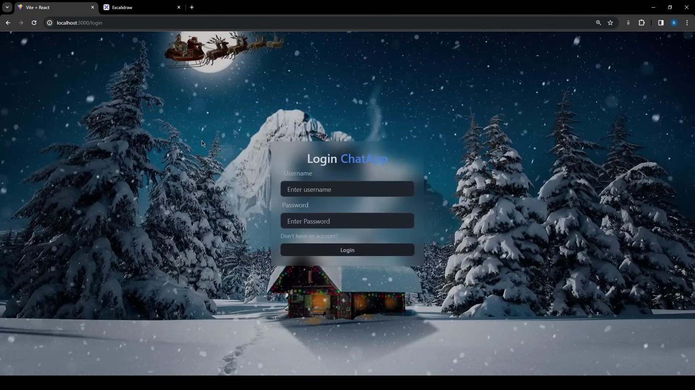
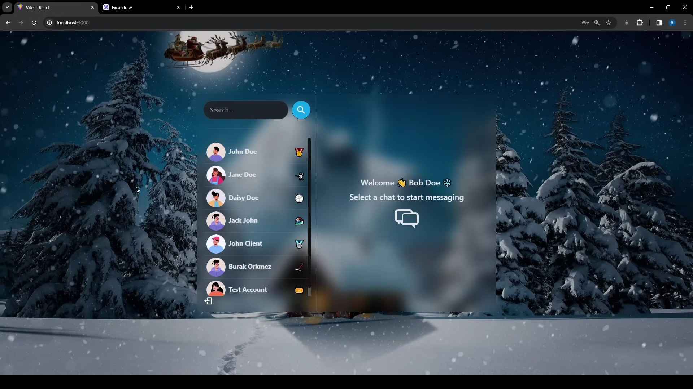
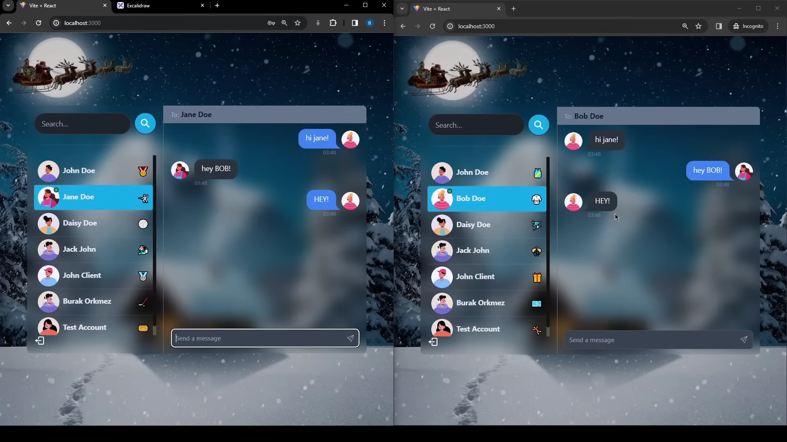

# MERN-Chatting-App

This MERN-Chatting-App is a real-time messaging platform. It supports user authentication, one-on-one and group chats, with real-time updates via WebSockets. The responsive React.js front-end ensures a smooth UX, while the Node.js and Express.js backend efficiently manages data and user interactions.

### Project Link:

[Visit Project's Live Web-App](https://chatting-app-mk.vercel.app/)

## Project's Screenshots =>





## Technologies Used

- **MongoDB**: Database
- **Express.js**: Backend Framework
- **React.js**: Frontend Framework
- **Node.js**: Backend Runtime Environment
- **WebSockets**: Protocol used for real-time messaging and communication between clients and the server.
- **JWT (JSON Web Tokens)**: For secure authentication and authorization
- **Socket.IO**: Library for enabling real-time, bi-directional communication
- **Bcrypt.js**: Library for hashing passwords to enhance security.
- **Cloudinary**: Cloud service for storing and serving images
- **Docker**: Containerization tool used for deploying and running the application in different environments.

## Features

- **Real-Time Messaging**: Send and receive messages instantly using WebSockets for real-time communication.
- **User Authentication**: Secure login and signup functionality using JWT (JSON Web Tokens).
- **Private & Group Chats**: Engage in both private one-on-one conversations and group chats with multiple users.
- **Responsive Design** : Fully responsive UI built with React.js, providing a seamless experience across all devices.
- **Chat Notifications**: Receive real-time notifications for new messages and chat invitations.
- **Message History**: Persistent storage of chat history in MongoDB, allowing users to view past conversations.
- **Typing Indicators**: Real-time indicators show when other users are typing in the chat.
- **User Profiles**: Manage and update user profiles with avatars and status messages.
- **Search Functionality**: Easily search for users and previous messages within chats.
- **File Sharing**: Share images, documents, and other files within the chat.
- **Real-Time Presence**: See when users are online or offline in real-time.

## Getting Started

To get a local copy up and running follow these simple steps.

### Prerequisites

- Node.js
- MongoDB

### Installation

1. Clone the repo

   ```sh
   git clone https://github.com/mk4levi/MERN-Chatting-App.git

   ```

2. Install NPM packages

   ```sh
   Frontend- 1. cd frontend 2. npm install
   Backend - 1. cd backend  2. npm install

   ```

3. Start the development server
   ```sh
   Frontend- 1. cd frontend 2. npm run start
   Backend - 1. cd backend  2. npm run dev
   ```

### Contact

My Portfolio - [My Portfolio](https://manthan-mk-portfolio.vercel.app/)<br>
My LinkedIn - [My LinkedIn](https://www.linkedin.com/in/mk4coder/)<br>
My Mail ID - [mksoul1811@gmail.com](mailto:mksoul1811@gmail.com)
